# Aditya Deore Portfolio

A polished, animated personal portfolio website for **Aditya Deore**, a Machine Learning Engineer and Full-Stack Developer based in Pune, India. This project combines a responsive React interface, cinematic animations, an interactive terminal-style résumé shell, and visual project case studies to showcase ML, full-stack, data, automation, and design-system work.

<p align="center">
  
</p>

## Visual Highlights

### Hero Portfolio Experience

The homepage is built as a single-page visual journey with animated sections, theme switching, a scrolling skills marquee, and a terminal-style command center for exploring résumé content.

<p align="center">
  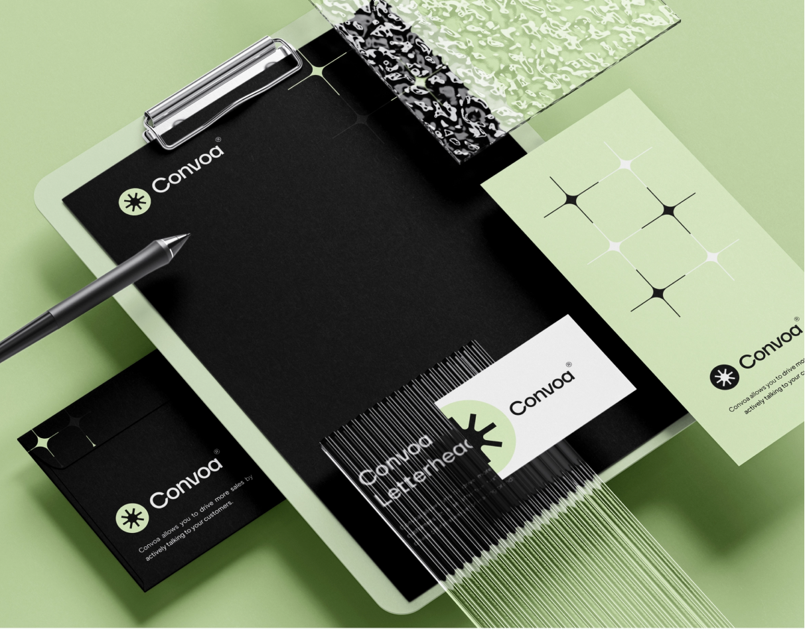
  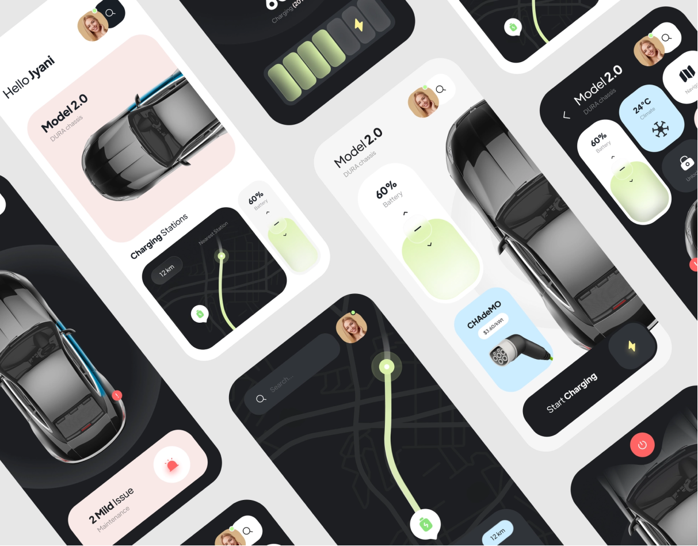
</p>

### Project Case Studies

Each project has a dedicated case-study page with project images, technology tags, delivery highlights, impact notes, and navigation between adjacent projects.

<p align="center">
  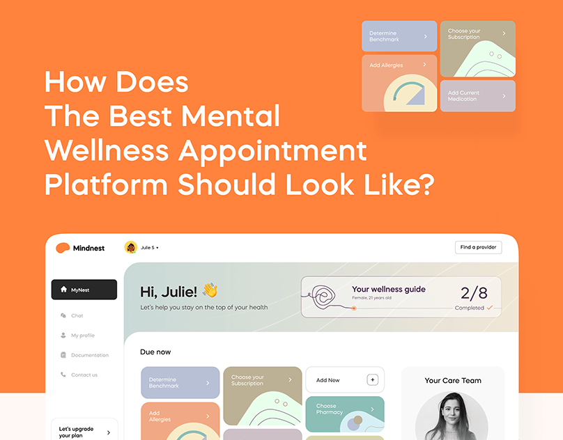
  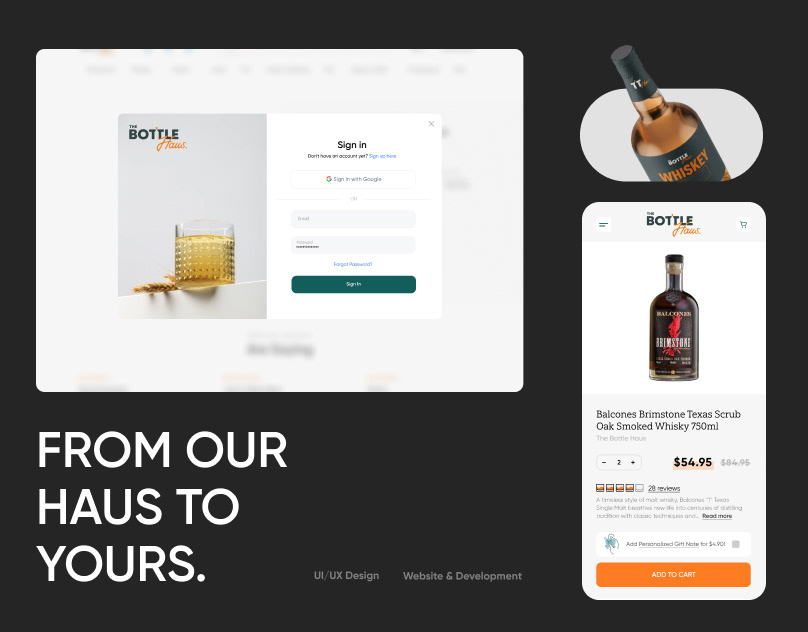
</p>

### Resume and Terminal Preview

The site includes resume preview assets and a terminal shell that lets visitors run commands like `whoami`, `projects`, `skills`, `resume`, and `contact`.

<p align="center">
  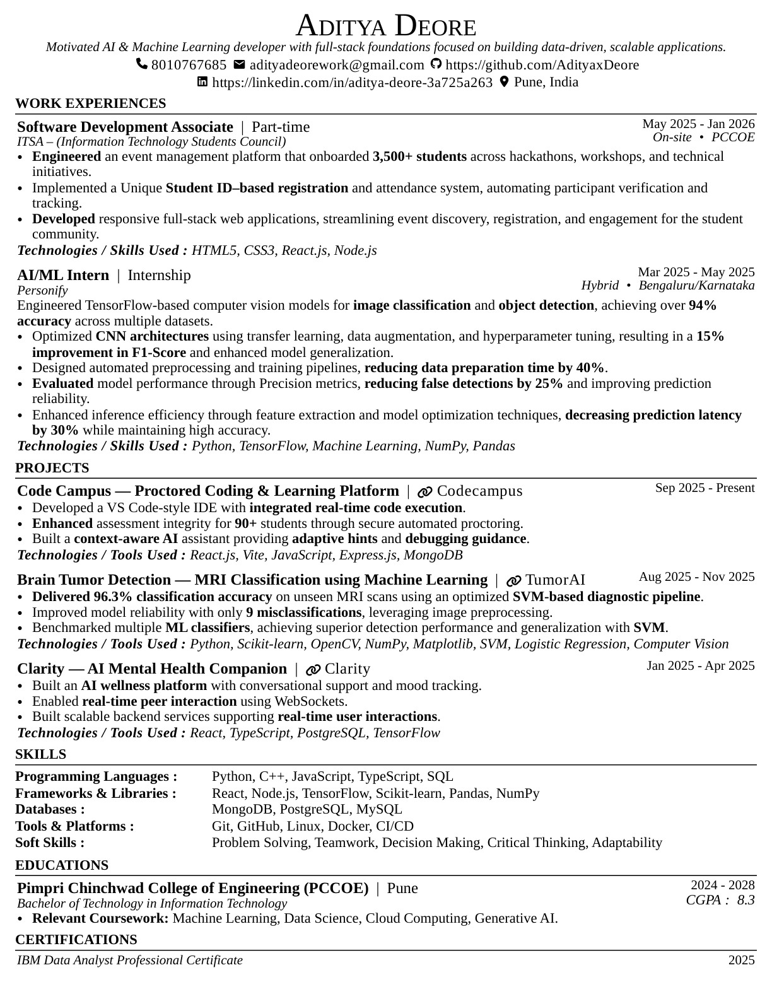
  
</p>

## Project Gallery

| ML / Data | Full-Stack | Automation / Web |
|---|---|---|
|  |  | 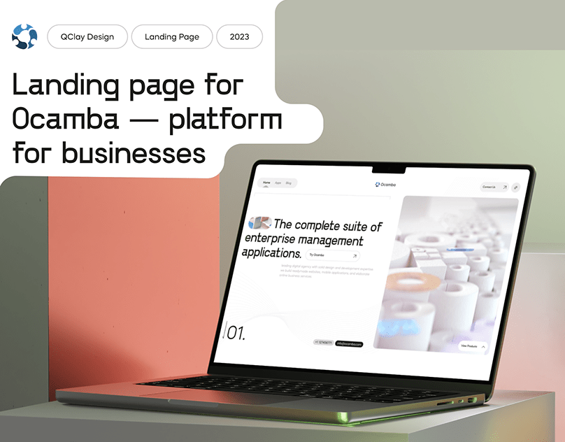 |
|  |  | 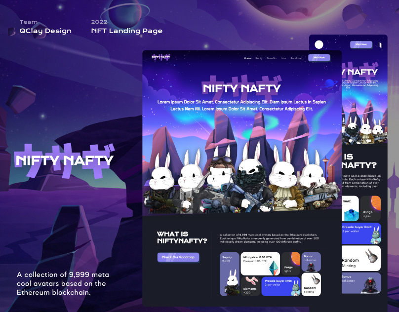 |
| 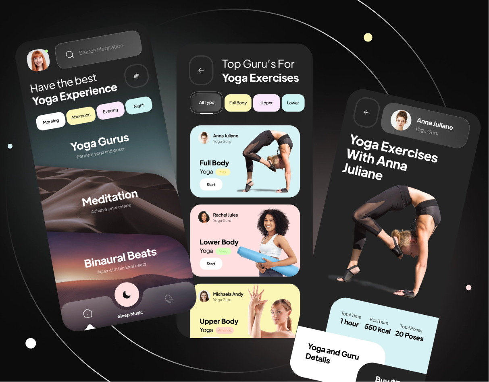 | 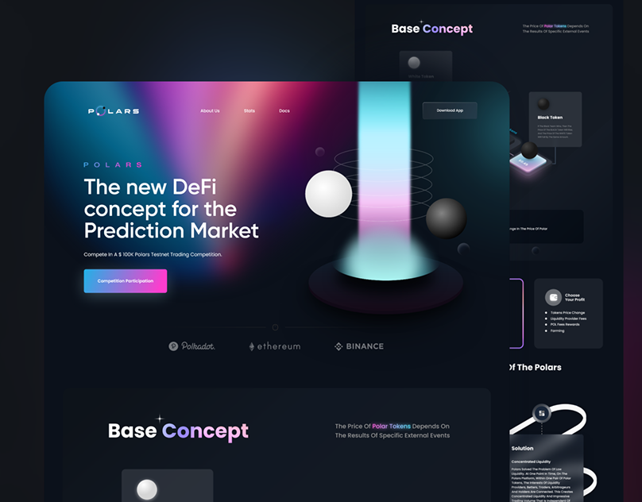 | 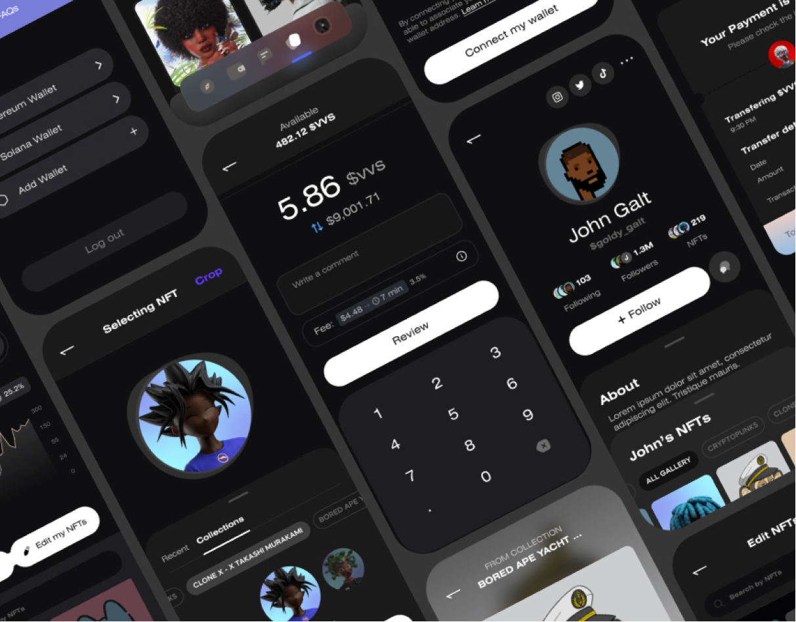 |

## Features

- Responsive single-page portfolio with smooth section navigation
- Dark and light theme support with system-preference initialization
- Animated hero, reveal, marquee, and project interactions
- Interactive terminal-style résumé shell with shortcuts and commands
- Project cards with individual case-study pages
- Skills organized by category with themed skill icons
- Resume preview and downloadable PDF link
- Contact links for email, LinkedIn, and GitHub
- Built for static deployment with client-side route rewrites

## Tech Stack

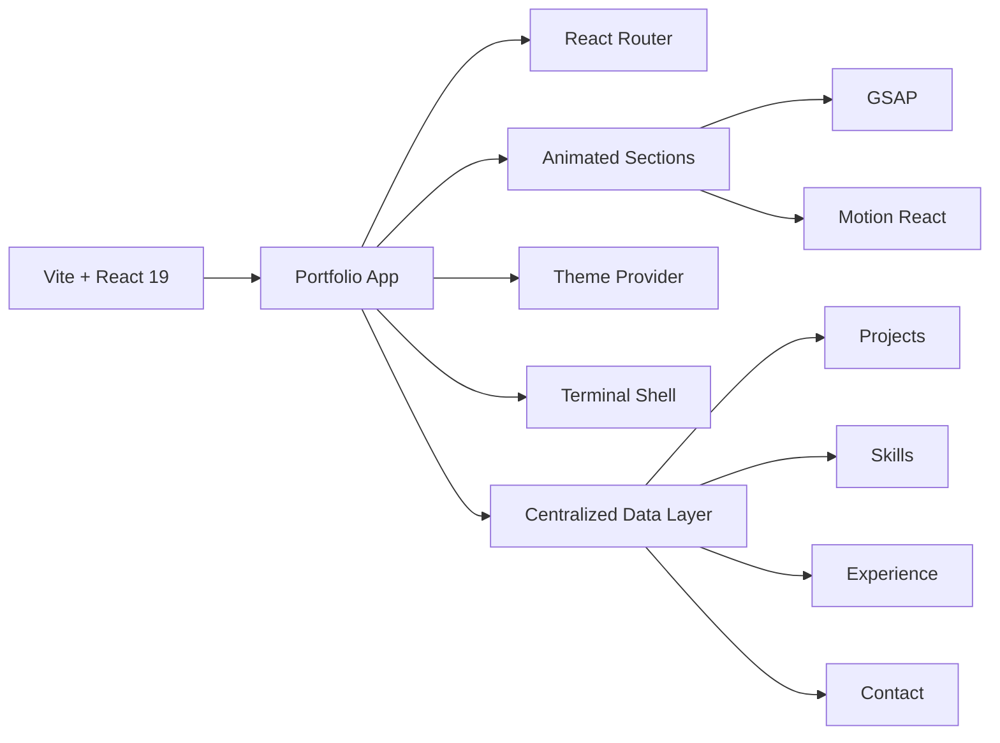

### Core Libraries

| Area | Tools |
|---|---|
| Frontend | React 19, TypeScript, Vite |
| Routing | React Router |
| Styling | Tailwind CSS, CSS variables, responsive layout utilities |
| Animation | GSAP, Motion React |
| UI | Radix UI primitives, Lucide icons |
| Terminal | react-terminal-ui, Prism.js |
| Deployment | Vercel-compatible static hosting |

## Project Structure

```txt
portfolio/
├─ index.html
├─ package.json
├─ vite.config.ts
├─ tsconfig.json
├─ vercel.json
├─ public/
│  ├─ images/
│  │  └─ projects/
│  ├─ assets/
│  │  └─ files/
│  ├─ resume-page-1.png
│  └─ resume-page-2.png
└─ src/
   ├─ components/
   │  ├─ sections/
   │  └─ ui/
   ├─ data/
   ├─ hooks/
   ├─ lib/
   ├─ pages/
   ├─ providers/
   ├─ styles/
   ├─ index.css
   └─ main.tsx
```

## Website Sections

| # | Section | Purpose |
|---:|---|---|
| 1 | About | Introduction, role, education, location, and focus areas |
| 2 | Portfolio Shell | Interactive terminal commands for résumé exploration |
| 3 | What I Bring | Value-focused overview of engineering strengths |
| 4 | Experience | Work history and timeline |
| 5 | Projects | Selected case studies with visual cards and detailed pages |
| 6 | Skills | Programming languages, AI/ML tools, frameworks, technologies, and soft skills |
| 7 | Resume | Resume preview and downloadable PDF link |
| 8 | Contact | Email, LinkedIn, and GitHub links |

## Selected Projects

| Project | Focus | Outcome |
|---|---|---|
| Conversational Analytics | NLP, FastAPI, React | Natural-language queries over structured business data with streaming responses |
| Eletix Dashboard | React, ML, TypeScript | Real-time monitoring dashboard for model metrics and inference health |
| MindNest | PyTorch, Deploy, Python | End-to-end ML app from training notebooks to a deployed inference API |
| BottleHaus | Full-Stack, Node, PostgreSQL | Product catalog and checkout flow with admin tooling and analytics |
| Ocamba Platform | API, Automation, React | Workflow automation layer connecting third-party services and internal tools |
| Polars Analytics | Data, Python, Visualization | High-performance data pipelines with interactive exploration views |
| MediTx | Healthcare, ML, FastAPI | Clinical decision-support prototype with explainable model outputs |
| NiftyNafty | Web3, React, API | Marketplace interface with wallet integration and live listing feeds |
| VVS Studio | Design Systems, React, Storybook | Component library and documentation site for a product design team |

## Interactive Terminal Commands

Visitors can explore the résumé through commands such as:

```txt
whoami       Quick identity card
about        Profile, education, and focus areas
experience   Work history timeline
projects     List case studies
skills       Technical toolkit by category
resume       Resume preview and PDF links
contact      Email, LinkedIn, and GitHub
open <id>    Open a full project case-study page
```

## Getting Started

Install dependencies:

```bash
npm install
```

Run the development server:

```bash
npm run dev
```

Open the site at:

```txt
http://localhost:5173
```

Build for production:

```bash
npm run build
```

Preview the production build locally:

```bash
npm run preview
```

Clean stale Vite cache if the dev server serves unexpected output:

```bash
npm run clean:vite
```

## Deployment

This project is configured for Vercel-style static hosting. The `vercel.json` file rewrites all routes to `index.html`, allowing React Router project pages to load correctly after refresh.

## Development Notes

- Source data lives under `src/data/`, including profile details, navigation, projects, skills, experience, terminal commands, and contact links.
- Section animations are implemented with GSAP and Motion React.
- Theme state is persisted in `localStorage` and initialized from system preference.
- Vite aliases `@` to the `src` directory.
- Static images are stored under `public/images/` and resume preview images under `public/`.

## Contact

- Email: [adityadeorework@gmail.com](mailto:adityadeorework@gmail.com)
- GitHub: [github.com/AdityaxDeore](https://github.com/AdityaxDeore)
- LinkedIn: [linkedin.com/in/aditya-deore-3a725a263](https://www.linkedin.com/in/aditya-deore-3a725a263)
